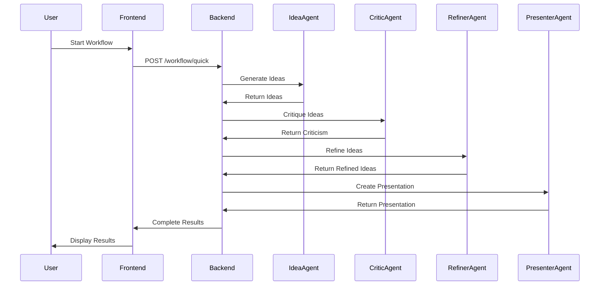

# 🛡️ Byte Defenders - AI-Powered Multi-Agent Creative Studio

[](https://www.typescriptlang.org/)
[](https://nodejs.org/)
[](https://reactjs.org/)
[](https://motia.dev/)
[](https://firebase.google.com/)
[](https://supabase.com/)

> **Transform ideas into reality with AI-powered multi-agent collaboration**

Byte Defenders is a comprehensive full-stack application that leverages multiple AI agents to help users brainstorm, critique, refine, and present creative ideas through an intelligent workflow system.

---

## 📋 Table of Contents

- [Overview](#-overview)
- [Key Features](#-key-features)
- [Tech Stack](#-tech-stack)
- [Project Structure](#-project-structure)
- [Getting Started](#-getting-started)
- [Development](#-development)
- [Deployment](#-deployment)
- [API Documentation](#-api-documentation)
- [Architecture](#-architecture)
- [Contributing](#-contributing)
- [License](#-license)

---

## 🎯 Overview

### The Problem

Traditional creative processes are:

- **Time-consuming**: Days or weeks to generate, critique, and refine ideas
- **Expensive**: Multiple stakeholders, consultants, and workshops
- **Limited**: Constrained by human bias and availability
- **Inconsistent**: Varying quality of feedback and refinement

### Our Solution

Byte Defenders provides **instant access to a virtual team of AI specialists** that can:

- ⚡ **Generate ideas** in seconds
- 🎯 **Provide unbiased critique** from multiple perspectives
- 🔄 **Iteratively refine** concepts based on structured feedback
- 📊 **Create professional presentations** ready for stakeholders
- 🌐 **Scale infinitely** without resource constraints

---

## ✨ Key Features

### 🤖 Multi-Agent System

- **Idea Generator**: Creates innovative concepts based on constraints
- **Critic Agent**: Provides constructive feedback and analysis
- **Refiner Agent**: Improves ideas based on criticism
- **Presenter Agent**: Generates professional presentations
- **Market Research Agent**: Analyzes market viability
- **Technical Feasibility Agent**: Assesses implementation complexity

### 🎨 User Experience

- **Intuitive Dashboard**: Clean, modern UI with shadcn/ui components
- **Real-time Updates**: See agent progress as workflows execute
- **Session Management**: Save, review, and continue previous sessions
- **Explainability**: Understand how agents reached their conclusions
- **History Tracking**: Complete audit trail of all agent interactions

### 🔒 Enterprise Features

- **Firebase Authentication**: Secure user management
- **Role-Based Access**: Control feature availability by plan
- **Payment Integration**: RazorPay for subscription management
- **Rate Limiting**: Protect against abuse
- **Comprehensive Logging**: Track all system activities

### 🚀 Developer Experience

- **TypeScript**: Full type safety across the stack
- **Hot Reload**: Fast development with instant feedback
- **API Documentation**: Complete OpenAPI specification
- **Testing**: Unit and integration test suites
- **Docker Support**: Containerized deployment

---

## 🛠️ Tech Stack

### Frontend

```json

{
  "framework": "React 18.3",
  "language": "TypeScript 5.8",
  "build": "Vite 7.3",
  "router": "React Router DOM 6.30",
  "ui": "shadcn/ui + Radix UI",
  "styling": "Tailwind CSS 3.4",
  "forms": "React Hook Form + Zod",
  "state": "@tanstack/react-query 5.83",
  "auth": "Firebase 12.7"
}
```

### Backend

```json
{
  "runtime": "Node.js 18+",
  "framework": "Express 4.18 + Motia 0.17",
  "language": "TypeScript 5.3",
  "ai": "Google Generative AI 0.21 + OpenAI 4.28",
  "database": "Supabase (PostgreSQL) 2.39",
  "cache": "Redis (Memurai on Windows)",
  "auth": "Firebase Admin 11.11",
  "monitoring": "Pino 8.17"
}
```

### Infrastructure

- **Containerization**: Docker + Docker Compose
- **CI/CD**: GitHub Actions
- **Hosting**: Cloud Run / AWS ECS / Azure Container Apps
- **Database**: PostgreSQL 15+
- **Cache**: Redis 6+

---

## 📁 Project Structure

```
Byte_Defenders/
├── frontend/                    # React frontend application
│   ├── src/
│   │   ├── app/                # App setup & routing
│   │   ├── components/         # Reusable UI components
│   │   │   ├── agents/        # Agent-specific components
│   │   │   ├── common/        # Shared components
│   │   │   ├── output/        # Output display components
│   │   │   ├── session/       # Session management components
│   │   │   └── ui/            # shadcn/ui components
│   │   ├── hooks/             # Custom React hooks
│   │   ├── lib/               # Utilities & API client
│   │   ├── pages/             # Page components
│   │   ├── services/          # API & business logic
│   │   ├── store/             # Context providers
│   │   └── types/             # TypeScript definitions
│   ├── public/                # Static assets
│   └── package.json           # Frontend dependencies
│
├── multi-agent-creative-studio/ # Backend API server
│   ├── apps/backend/
│   │   └── src/
│   │       ├── agents/        # AI agent implementations
│   │       ├── controllers/   # API route handlers
│   │       ├── middleware/    # Express middleware
│   │       ├── models/        # Database models
│   │       ├── routes/        # API routes
│   │       ├── services/      # Business logic
│   │       ├── types/         # TypeScript types
│   │       └── index.ts       # Server entry point
│   ├── docs/                  # API documentation
│   ├── migrations/            # Database migrations
│   ├── .env                   # Environment variables
│   └── package.json           # Backend dependencies
│
├── src/                        # Motia steps
│   ├── hello/                 # Example API steps
│   └── petstore/              # Pet store example
│
├── AGENTS.md                   # AI assistant guide
├── API_REFERENCE.md            # API documentation
├── DEPLOYMENT_GUIDE.md         # Deployment instructions
├── QUICK_START.md              # Quick setup guide
├── motia.config.ts            # Motia configuration
└── package.json               # Root dependencies
```

---

## 🚀 Getting Started

### Prerequisites

Ensure you have the following installed:

- **Node.js**: 18.0 or higher ([Download](https://nodejs.org/))
- **npm**: 9.0 or higher (comes with Node.js)
- **Git**: For version control ([Download](https://git-scm.com/))
- **Redis**: For caching (Windows: [Memurai](https://www.memurai.com/))
- **Firebase Account**: For authentication ([Sign up](https://firebase.google.com/))
- **Supabase Account**: For database (optional) ([Sign up](https://supabase.com/))

### Installation

1. **Clone the repository**

   ```bash
   git clone https://github.com/KunjShah95/Byte_Defenders.git
   cd Byte_Defenders
   ```

2. **Install root dependencies**

   ```bash
   npm install
   ```

3. **Install frontend dependencies**

   ```bash
   cd frontend
   npm install
   cd ..
   ```

4. **Install backend dependencies**

   ```bash
   cd multi-agent-creative-studio
   npm install
   cd ..
   ```

### Configuration

#### Backend Configuration

Create `multi-agent-creative-studio/.env`:

```env
# Server Configuration
PORT=3000
NODE_ENV=development
HOST=localhost

# AI/GenAI Service
GOOGLE_API_KEY=your_google_ai_api_key_here
OPENAI_API_KEY=your_openai_api_key_here

# Database (Supabase)
SUPABASE_URL=https://your-project.supabase.co
SUPABASE_KEY=your_supabase_anon_key
SUPABASE_SERVICE_ROLE_KEY=your_supabase_service_role_key

# Redis Cache
REDIS_URL=redis://localhost:6379
REDIS_PASSWORD=
REDIS_DB=0

# Firebase Admin
FIREBASE_PROJECT_ID=your-firebase-project-id
FIREBASE_PRIVATE_KEY=your-firebase-private-key
FIREBASE_CLIENT_EMAIL=your-firebase-client-email

# CORS Origins (comma-separated)
CORS_ORIGIN=http://localhost:5173,http://localhost:5174,http://localhost:5175

# Logging
LOG_LEVEL=info
```

#### Frontend Configuration

Create `frontend/.env`:

```env
# Firebase Configuration
VITE_FIREBASE_API_KEY=your_firebase_api_key
VITE_FIREBASE_AUTH_DOMAIN=your-project.firebaseapp.com
VITE_FIREBASE_PROJECT_ID=your-project-id
VITE_FIREBASE_STORAGE_BUCKET=your-project.appspot.com
VITE_FIREBASE_MESSAGING_SENDER_ID=123456789
VITE_FIREBASE_APP_ID=1:123456789:web:abcdef

# API Configuration
VITE_API_BASE_URL=http://localhost:3000
```

### Running the Application

You need **TWO terminals** running simultaneously:

#### Terminal 1: Backend Server

```bash
cd multi-agent-creative-studio
npm run dev
```

You should see:

```
Backend Starting...
CORS Config: http://localhost:5173,http://localhost:5174,http://localhost:5175
Server started successfully { port: 3000, env: 'development' }
```

#### Terminal 2: Frontend Server

```bash
cd frontend
npm run dev
```

You should see:

```
VITE v7.3.0  ready in 2345 ms

➜  Local:   http://localhost:5173/
➜  Network: use --host to expose
```

### Accessing the Application

- **Frontend**: <http://localhost:5173>
- **Backend API**: <http://localhost:3000>
- **API Health Check**: <http://localhost:3000/api/v1/health>
- **Motia Workbench**: <http://localhost:3000> (run `npm run dev` in root)

### Verification

Test the backend is running:

```bash
curl http://localhost:3000/api/v1/health
```

Expected response:

```json
{
  "status": "healthy",
  "timestamp": "2025-12-21T...",
  "uptime": 123.45
}
```

---

## 💻 Development

### Available Commands

#### Root (Motia)

```bash
npm run dev              # Start Motia development server + Workbench
npm run start            # Start production server (no hot reload)
npm run generate-types   # Generate TypeScript types from steps
npm run build            # Build for production
```

#### Backend

```bash
npm run dev              # Start backend with hot reload (ts-node)
npm run build            # Compile TypeScript
npm run start            # Start production build
npm run test             # Run tests
npm run lint             # Check code style
npm run type-check       # TypeScript type checking
```

#### Frontend

```bash
npm run dev              # Start development server (Vite)
npm run build            # Production build
npm run build:dev        # Development build
npm run preview          # Preview production build
npm run lint             # ESLint check
```

### Code Style Guidelines

#### TypeScript/JavaScript

- Use **ESLint** for linting
- Follow **Airbnb style guide** patterns
- Use **Prettier** for formatting
- Prefer `const` over `let`, avoid `var`
- Use descriptive variable names
- Write JSDoc comments for public functions

#### React Components

- Use **functional components** with hooks
- Prefer **named exports** over default exports
- Extract reusable logic into **custom hooks**
- Use **TypeScript interfaces** for props
- Follow **component/index.ts** pattern for organization

#### API Endpoints

- Follow **RESTful** conventions
- Use **HTTP status codes** appropriately
- Return **consistent error formats**
- Include **request validation**
- Document with **OpenAPI/Swagger**

### Testing

Run tests:

```bash
# Backend tests
cd multi-agent-creative-studio
npm test

# Frontend tests
cd frontend
npm test

# Run with coverage
npm test -- --coverage
```

### Debugging

#### VS Code Launch Configuration

Create `.vscode/launch.json`:

```json
{
  "version": "0.2.0",
  "configurations": [
    {
      "name": "Debug Backend",
      "type": "node",
      "request": "launch",
      "runtimeArgs": ["-r", "ts-node/register"],
      "args": ["${workspaceFolder}/multi-agent-creative-studio/apps/backend/src/index.ts"],
      "env": {
        "NODE_ENV": "development"
      },
      "console": "integratedTerminal",
      "internalConsoleOptions": "neverOpen"
    },
    {
      "name": "Debug Frontend",
      "type": "chrome",
      "request": "launch",
      "url": "http://localhost:5173",
      "webRoot": "${workspaceFolder}/frontend/src"
    }
  ]
}
```

---

## 🚢 Deployment

### Docker Deployment (Recommended)

#### Build and Run Containers

```bash
# Build images
docker-compose build

# Start services
docker-compose up -d

# View logs
docker-compose logs -f

# Stop services
docker-compose down
```

#### Production Deployment

```bash
# Use production configuration
docker-compose -f docker-compose.prod.yml up -d
```

### Cloud Deployment

See [DEPLOYMENT_GUIDE.md](./DEPLOYMENT_GUIDE.md) for detailed instructions on:

- AWS (ECS, EC2, Lambda)
- Google Cloud (Cloud Run, GKE)
- Azure (Container Apps, AKS)
- Digital Ocean (App Platform)
- Vercel/Netlify (Frontend)

### Environment Variables

Ensure all environment variables are set in your deployment platform:

- Backend: Use secrets management (AWS Secrets Manager, Google Secret Manager)
- Frontend: Build-time environment variables

---

## 📚 API Documentation

### Base URL

```
http://localhost:3000/api/v1
```

### Authentication

Include Firebase ID token in requests:

```http
Authorization: Bearer <firebase-id-token>
```

### Core Endpoints

#### Health Check

```http
GET /health
```

#### Sessions

```http
POST   /sessions                          # Create session
GET    /sessions/:sessionId               # Get session details
GET    /sessions/:sessionId/explainability # Get execution details
DELETE /sessions/:sessionId               # Delete session
```

#### Workflows

```http
POST /sessions/:sessionId/workflow/quick  # Quick workflow (Idea + Critic)
POST /sessions/:sessionId/workflow/full   # Full workflow (all agents)
POST /sessions/:sessionId/workflow/custom # Custom agent selection
```

#### Agents

```http
POST /sessions/:sessionId/agents/idea     # Generate ideas
POST /sessions/:sessionId/agents/critic   # Critique ideas
POST /sessions/:sessionId/agents/refine   # Refine ideas
POST /sessions/:sessionId/agents/present  # Create presentation
```

See [multi-agent-creative-studio/API_REFERENCE.md](./multi-agent-creative-studio/API_REFERENCE.md) for complete API documentation.

---

## 🏗️ Architecture

### System Overview

```
┌─────────────┐
│   Browser   │
└──────┬──────┘
       │ HTTPS
       ▼
┌─────────────────┐
│  React Frontend │ (Port 5173)
│   + Firebase    │
└────────┬────────┘
         │ REST API
         ▼
┌─────────────────────┐
│  Express Backend    │ (Port 3000)
│  + Multi-Agents     │
└──┬──────────────┬───┘
   │              │
   │ AI APIs      │ Database
   ▼              ▼
┌─────────┐  ┌──────────┐
│ OpenAI  │  │ Supabase │
│ Gemini  │  │(Postgres)│
└─────────┘  └──────────┘
```

### Agent Workflow



### Tech Decisions

- **Why Motia?**: Unified backend framework for APIs, events, and workflows
- **Why TypeScript?**: Type safety across the entire stack
- **Why Firebase?**: Managed authentication with easy social login
- **Why Supabase?**: Open-source PostgreSQL with real-time features
- **Why React Query?**: Efficient server state management
- **Why shadcn/ui?**: Customizable, accessible component library

---

## 🤝 Contributing

We welcome contributions! Please follow these guidelines:

### Getting Started

1. Fork the repository
2. Create a feature branch: `git checkout -b feature/amazing-feature`
3. Make your changes
4. Run tests: `npm test`
5. Commit: `git commit -m 'Add amazing feature'`
6. Push: `git push origin feature/amazing-feature`
7. Open a Pull Request

### Code Standards

- Follow existing code style
- Write tests for new features
- Update documentation
- Add meaningful commit messages

### Reporting Issues

Use GitHub Issues and include:

- Description of the problem
- Steps to reproduce
- Expected vs actual behavior
- Screenshots (if applicable)
- Environment details

---

## 📄 License

This project is licensed under the MIT License - see the [LICENSE](LICENSE) file for details.

---

## 👥 Team

**Byte Defenders Team**

- Lead Developer: [Kunj Shah](https://github.com/KunjShah95)

---

## 🙏 Acknowledgments

- [Motia](https://motia.dev/) - Backend framework
- [shadcn/ui](https://ui.shadcn.com/) - UI components
- [OpenAI](https://openai.com/) - AI capabilities
- [Google AI](https://ai.google.dev/) - Gemini models
- [Firebase](https://firebase.google.com/) - Authentication
- [Supabase](https://supabase.com/) - Database

---

## 📞 Support

- **Documentation**: [./docs](./docs)
- **Issues**: [GitHub Issues](https://github.com/KunjShah95/Byte_Defenders/issues)
- **Discussions**: [GitHub Discussions](https://github.com/KunjShah95/Byte_Defenders/discussions)

---

## 🗺️ Roadmap

### Phase 1 (Current)

- [x] Multi-agent system
- [x] Session management
- [x] Basic UI
- [x] Firebase auth

### Phase 2 (In Progress)

- [ ] Payment integration (RazorPay)
- [ ] Advanced workflows
- [ ] Team collaboration
- [ ] Export capabilities

### Phase 3 (Planned)

- [ ] White-label solution
- [ ] Mobile app
- [ ] Enterprise features
- [ ] Advanced analytics

---

<div align="center">

**Built with ❤️ by Byte Defenders**

[Website](#) • [Documentation](./docs) • [API Reference](./multi-agent-creative-studio/API_REFERENCE.md)

</div>
